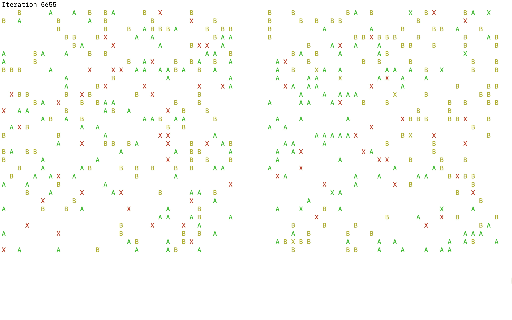
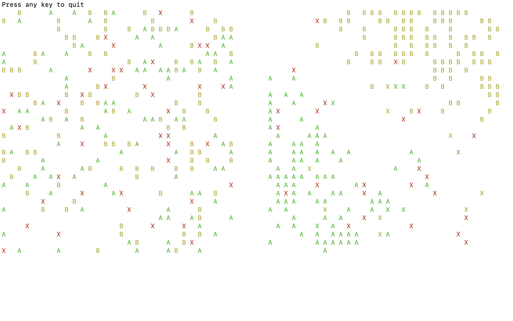
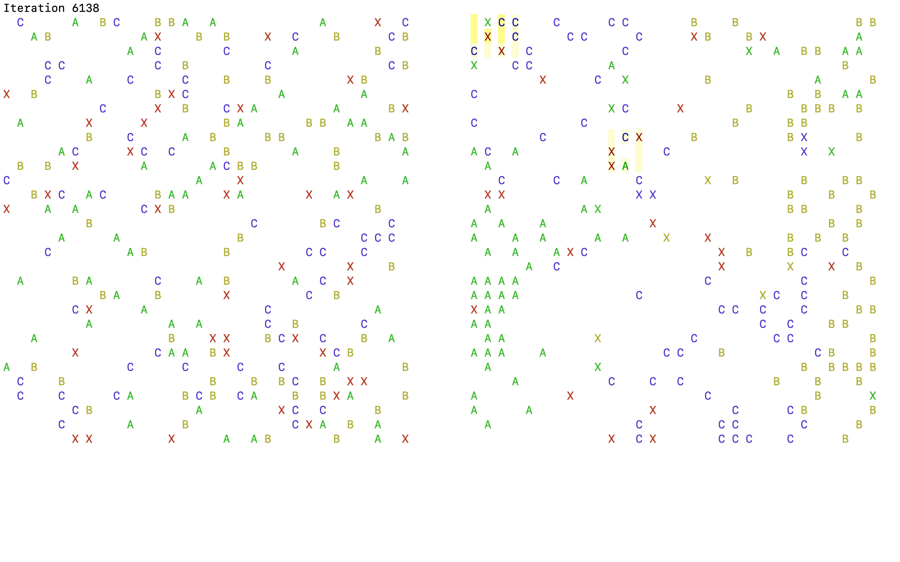
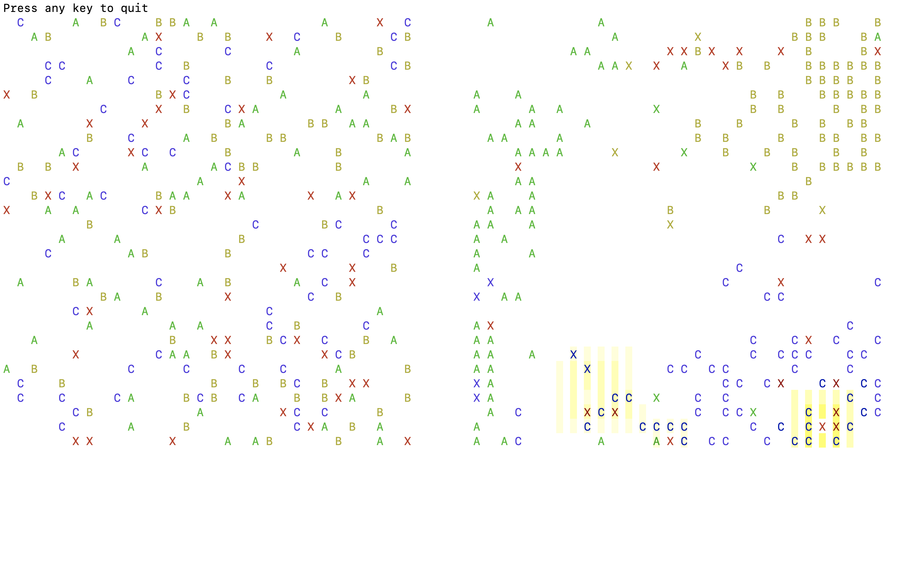

# Sorting with Multi-Agents System

## How to execute the code

>Programs were tested on macOS and will work on Linux. If you run on Windows,  please use a terminal that can display colour, otherwise `./legacy/main.py` won't run.

The project doesn't need any external dependencies.
Be sure to have your terminal **full screen** and **colour enabled** (use *PowerShell* on Windows)

```
git clone <link of the git repo>
cd python
python3 version1.py
python3 version2.py
```

You can stop the execution with `Ctrl-C` while it is running or press any key if it is done.

The initial 2D-grid is on the left side and the current 2D-grid is on the right side.

The agent is the `X`, the fruits are `A`, `B`
, and `C`. Pheromones are represented with a yellowish background, the more intense it is the more pheromone there is.

The code is pretty much self-explanatory, don't hesitate to go through it to grasp what's under the hood.

*You can change the `width` and the `height` of the 2D grid in either `version1.py` or `version2.py`. Try to keep the width small enough so that two grids can fit on your screens side-to-side (if not, that won't change anything but it will be harder to see the animation).*

## From random grid to sorted grid

We have a 2D grid filled randomly with fruits of different types.
We want a group of agents to sort these fruits by type. Each agent is not aware of the global state of the 2D grid.

### How to define the problem

We define three `classes` for this problem.

- `Environment` keeps the global state of display it on the terminal with the `curses` library.
- `Agent` acts based on its neighbourhood.
- `Fruit` can be carried by `Agent` and have a type that defines their colour on the screen.

To correctly display and refresh the information in the terminal, we use `curses.wrapper` to call our main loop. It returns a `stdscr` used by `Environment` to print at any position and to refresh the screen.

### The main loop

At first, we initialise some values to hide the cursor and define the colours.

```python
# Clear screen
curses.curs_set(0) # invisible cursor
curses.use_default_colors()
stdscr.clear()

# Define Colors
curses.init_pair(0, 0, -1) # Base
curses.init_pair(1, 1, -1) # A
curses.init_pair(2, 2, -1) # B
curses.init_pair(3, 3, -1) # Agent
```

Then, we define the **environment** with its size and fill it with **agents** and **fruits**.

```python
env = Environment(30, 30, stdscr)
env.initialise_agents(40)
env.initialise_fruits(200)
```

To fill the **environment**, we provide the desired number of elements. If there is no more space left, some elements won't be created.

```python
def generate_item(self, desired_number, assign_function, R=10):
  for n in range(desired_number):
    x, y = random.randint(0, self.m - 1), random.randint(0, self.n - 1)
    r = 0
    while r < R and self.grid[y][x]:
      # Try at most R times
      x, y = random.randint(0, self.m - 1), random.randint(0, self.n - 1)
      r += 1
    if not self.grid[y][x]:
      assign_function(x, y)
```

The number of iteration is fixed. There is no way for the agents to determine if the 2D grid is sorted or not, and we decided to avoid adding logic to evaluate how well fruits are gathered in clusters in the grid.

On each iteration, each agent act based on its surrounding environment. To avoid any bias, the order in which agents act is changed for each iteration.

```python
for i in range(int(2e4)):
  stdscr.addstr(0, 0, f'Iteration {i}\t')
  stdscr.refresh()
  random.shuffle(env.agents) # Shuffle to avoid bias
  for agent in env.agents:
    agent.act()
    env.update()
  env.display(2 * 30 + 8)
```

After each action, we update the state of the environment. It keeps its information up to date for the following agents.

### How do agents act?

The agent looks at the 8 cells around, and record empty cells, and cells with a fruit.

```python
empty_neighbors = list(self.parent.get_empty_neighbors(self.x, self.y))
fruit_neighbors = list(self.parent.get_fruit_neighbors(self.x, self.y))
```

If there is a fruit around, it chooses one at random and updates its memory with it.

```python
key_fruit = 0
if len(fruit_neighbors) > 0:
  key_fruit = random.choice(fruit_neighbors).key

# Update memory
while len(self.memory) >= Agent.memory_length:
  self.memory.pop(0)
self.memory.append(key_fruit)
```

If there is no empty cell around, it waits for the next round.

```python
if len(empty_neighbors) == 0:
  return
```

If there is an empty cell to move on, it chooses one at random.

```python
# Move
old_x, old_y = self.x, self.y
self.x, self.y = random.choice(empty_neighbors)
```

If it carries a fruit, it releases it with the probability `(frequency / (Agent.k_minus + frequency)) ** 2`.

With `Agent.k_minus` a constant and `frequency` the frequency of occurrence of its current fruit in its memory.

```python
def will_release(self):
  frequency = self.get_frequency(self.fruit.key)
  return random.random() < (frequency / (Agent.k_minus + frequency)) ** 2
```

If it has no fruit, it chooses the first one that passes the statistical test **T**.

**T** passes with a probability `(Agent.k_plus / (Agent.k_plus + frequency)) ** 2`, with `Agent.k_plus` a constant, and `frequency` as before.

```python
def will_carry(self, key):
    frequency = self.get_frequency(key)
    return random.random() < (Agent.k_plus / (Agent.k_plus + frequency)) ** 2
```

The agent counts the number of occurrences of its current fruit in its memory to measure `frequency`.

It can miscount some fruits, with a probability `Agent.error_rate`.

```python
def get_frequency(self, key):
  assert len(self.memory) <= Agent.memory_length
  assert not key is None
  if len(self.memory) == 0:
    return 0
  count, other = 0, 0
  for value in self.memory:
    if value == key:
      count += 1
    elif value != 0:
      other += 1
  return (count + other * Agent.error_rate) / len(self.memory)
```

### Action!

Below is an animation (*GIF*) of agents sorting the grid.



On the left, there is the unsorted grid. On the right, there is the grid after roughly **10,000** iterations. You can see that the `A`'s and the `B`'s have been split.



## Some heavy fruits

Some fruits are heavy and need two agents to move them. Each agent can diffuse around its position signal to call for help, but can't call specifically any other agent. Each agent can detect signals but cannot dissociate any signals from any agents (not even from their signals).

The code for this second problem is at `python/version2.py`.

### How to define the problem

We define the problem exactly as before. We simply add a `C`fruit that is the fruit that needs two agents to be moved.

### The code, or how the agents ask for help

For the most part, the logic is the same as before. The only difference is how the `Agents` react when they interact with a `C` fruit, this mostly is is the `act` method of the `HelperAgent`.

`C`'s fruit are marked as `heavy fruit` in code, to reflect the idea that they cannot be hold alone.

As before, the `Agent` looks around and update its memory.

```py
def act(self):
  # ...
  empty_neighbors = list(self.parent.get_empty_neighbors(self.x, self.y))
  fruit_neighbors = list(self.parent.get_fruit_neighbors(self.x, self.y))
  key_fruit = 0
  if len(fruit_neighbors) > 0:
      key_fruit = random.choice(fruit_neighbors).key

  # Update memory
  while len(self.memory) >= Agent.memory_length:
      self.memory.pop(0)
  self.memory.append(key_fruit)

  if len(empty_neighbors) == 0:
      fruit = None
      for f in fruit_neighbors:
          if f.key == HelperAgent.heavy_fruit_key and self.will_carry(f.key):
              fruit = f
              break
      if fruit: # Heavy fruit
          # Stay in place and release signals
          self.release_signals()
      return
  # ...
```

When an `Agent` needs help, it releases pheromones around, at a `diffusion_distance` distance (*the further from the agent, the weaker the pheromons are*).

> `HelperAgent.heavy_fruit_key` hold the value that identifies heavy fruit, in our exemple, it is the letter `C`.

If there is another `Agent` around the fruit, it ask this agent to become its `helper`. The other agent will then stop to `act`, and be controlled only by its main `Agent`.

```py
def act(self):
  if self.is_helping: # Controlled by its main agent
      return
  # ...
  # Move with heavy fruit
  if self.fruit.key == HelperAgent.heavy_fruit_key:
    if self.will_release():
        # Release fruit
        self.fruit.x, self.fruit.y = old_x, old_y
        self.color = Agent.color
        self.fruit.is_carried = False
        self.fruit = None
        # Release helper
        self.helper.is_helping = False
        self.helper.color = Agent.color
    else:
      # If fruit is heavy, helper must be defined
      assert type(self.helper) == HelperAgent
      self.helper.x, self.helper.y = old_x, old_y
  # ...
  # Pick an heavy fruit
  if fruit.key == HelperAgent.heavy_fruit_key: # If is heavy
    # Look if there is someone around the fruit
    for x, y in self.parent.get_neighbors(fruit.x, fruit.y):
        if type(self.parent.grid[y][x]) == HelperAgent and not self.parent.grid[y][x] is self:
            # Found someone to help
            self.helper = self.parent.grid[y][x]
            self.parent.grid[y][x].is_helping = True

            self.x, self.y = fruit.x, fruit.y # Move on fruit
            self.color = fruit.color
            self.helper.color = fruit.color
            fruit.is_carried = True
            self.fruit = fruit

            return

    # Else stay in place and release signals
    self.x, self.y = old_x, old_y
    self.release_signals()
    # ...
```

If an `Agent` doesn't have a `fruit` to carry and isn't picking up a `fruit`, it will look around for signal and choose the first one, at random, with noone or nothing on it.

`signal_neighbors` contains all the cells around, this is why there is to be at least one cell in it (if not, the `Agent` is in a place it is not suppose to be). For each cells, this array contains the strength of the pheromones on it.

```py
def act(self):
  # ...
  signal_neighbors = [(x, y, self.parent.signal_grid[y][x]) for x, y in list(self.parent.get_neighbors(old_x, old_y))]
  assert 1 <= len(signal_neighbors) <= 8
  random.shuffle(signal_neighbors)
  signal_neighbors.sort(key=lambda signal: signal[2])
  i = 1
  signal = None
  while i < len(signal_neighbors) + 1 and signal_neighbors[-i][2] > 0:
      # There is a signal to follow
      if not self.parent.grid[signal_neighbors[-i][1]][signal_neighbors[-i][0]]:
          signal = signal_neighbors[-i]
          break
      i += 1
  if signal:
      self.x, self.y = signal[0], signal[1]
```

Pheromones decay with time, this is handle by the `ComplexEnvironment` (*not so complex by the way*). The decay is linear, with a step of `ComplexEnvironment.decay_rate`.

```py
class ComplexEnvironment(Environment):
    decay_rate = 0.1

    # ...
    def decay_signals(self):
      for i in range(self.n):
          for j in range(self.m):
              self.signal_grid[i][j] = max(0, self.signal_grid[i][j] - ComplexEnvironment.decay_rate)
    # ...
```

As this is it for the `HelperAgent` logic, if you want deeper details, feel to have a look in the code!

> As you've seen, pheromones adds up together and do not belong to anyone. That mimics real pheromones interactions. To avoid problem with too large pheromonon strengh (*and to make the display easier*), we clamp the strenght between `0` and `1`. If we hadn't, the strengh could have raise to such value that it never goes down to zero (and so make the convergence harder).


### Display pheromones

The `display` method of the environement has been a little bit updated to display pheromones, nothing to complex.

We choose to display the pheromones with colors `227` to `233` (`id`'s are given by `curses`). On our MacOS terminal, these colors goes from *yellow* to *white*, however this could be different on your terminal.

We choose to display the mitigation of pheromones with 5 levels, going from 1 to 0, uniformly dispatched. Each level has a color, `1` being the weakest, a whitish color, a `5` the strongest, a yellowish color.

Because `Agents` can be on top of pheromones, the level's color is applied to the background. Thus, we need 5 combinaisons of background and frontground for each level.

```py
# Define Colors with Signal Background (5 level, 0 - 0.2 - 0.4 - 0.8 - 1.0 -)
level_color = [231, 230, 229, 228, 227]
# Normal
curses.init_pair(0, 0, -1) # Base
curses.init_pair(1, 1, -1) # Agent
curses.init_pair(2, 2, -1) # A
curses.init_pair(3, 3, -1) # B
curses.init_pair(4, 4, -1) # C
# Level 1
curses.init_pair(10, 0, level_color[0]) # Base
curses.init_pair(11, 1, level_color[0]) # Agent
curses.init_pair(12, 2, level_color[0]) # A
curses.init_pair(13, 3, level_color[0]) # B
curses.init_pair(14, 4, level_color[0]) # C
# Level 2
curses.init_pair(20, 0, level_color[1]) # Base
curses.init_pair(21, 1, level_color[1]) # Agent
curses.init_pair(22, 2, level_color[1]) # A
curses.init_pair(23, 3, level_color[1]) # B
curses.init_pair(24, 4, level_color[1]) # C
# Level 3
curses.init_pair(30, 0, level_color[2]) # Base
curses.init_pair(31, 1, level_color[2]) # Agent
curses.init_pair(32, 2, level_color[2]) # A
curses.init_pair(33, 3, level_color[2]) # B
curses.init_pair(34, 4, level_color[2]) # C
# Level 4
curses.init_pair(40, 0, level_color[3]) # Base
curses.init_pair(41, 1, level_color[3]) # Agent
curses.init_pair(42, 2, level_color[3]) # A
curses.init_pair(43, 3, level_color[3]) # B
curses.init_pair(44, 4, level_color[3]) # C
# Level 5
curses.init_pair(50, 0, level_color[4]) # Base
curses.init_pair(51, 1, level_color[4]) # Agent
curses.init_pair(52, 2, level_color[4]) # A
curses.init_pair(53, 3, level_color[4]) # B
curses.init_pair(54, 4, level_color[4]) # C
```

So, we first update the empty cells, then the cells with `Agents` or `Fruits`.

```py
def display(self, x_shift=0):
    # Empty cell
    for i in range(self.n):
        for j in range(self.m):
            # With pheromones
            if self.signal_grid[i][j] > 0: # 5 level, [0, 0.2, 0.4, 0.6, 0.8]
                pair_level = str(int(10 * self.signal_grid[i][j]) // 2)
                stdscr.addstr(i + 1, 2 * j + x_shift, ' ', color_pair(int(pair_level + '0')))
            # Without pheromones
            else:
                stdscr.addstr(i + 1, 2 * j + x_shift, ' ')

    # Cells with agents
    for agent in self.agents:
        i, j = agent.y, agent.x
        # On top of pheromones
        if self.signal_grid[i][j] > 0:
            pair_level = str(int(10 * self.signal_grid[i][j]) // 2)
            stdscr.addstr(i + 1, 2 * j + x_shift, 'X', color_pair(int(pair_level + str(agent.color))))
        # On top of nothing
        else:
            stdscr.addstr(i + 1, 2 * j + x_shift, 'X', color_pair(agent.color))

    # Cells with fruits
    for fruit in self.fruits:
        if not fruit.is_carried:
            i, j = fruit.y, fruit.x
            # On top of pheromones
            if self.signal_grid[i][j] > 0:
                pair_level = str(int(10 * self.signal_grid[i][j]) // 2)
                stdscr.addstr(i + 1, 2 * j + x_shift, fruit.key, color_pair(int(pair_level + str(fruit.color))))
            # On top of nothing
            else:
                stdscr.addstr(i + 1, 2 * j + x_shift, fruit.key, color_pair(fruit.color))

    stdscr.refresh()
```

### Action!

Below is an animation (*GIF*) of agents sorting the grid, using pheromones to help eachothers.



On the left, there is the unsorted grid. On the right, this is the grid after **20,000** iterations. You can see that the `A`'s, `B`'s, and `C`'s have been split.


